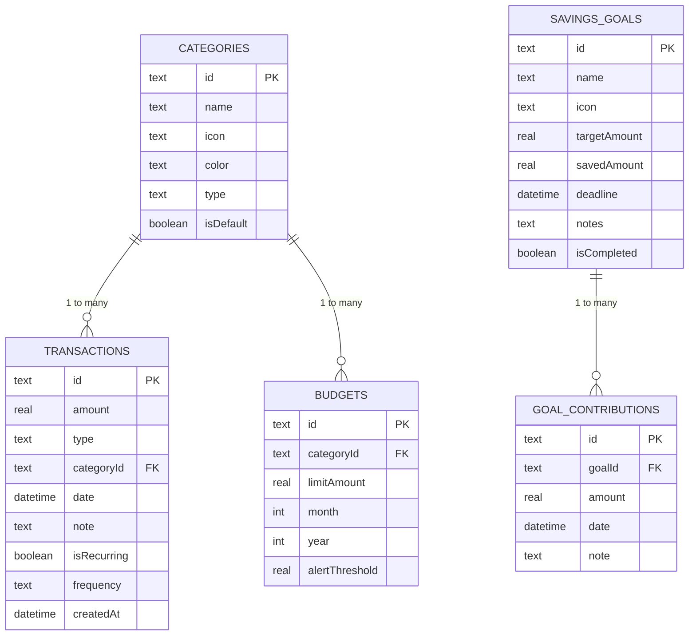

# BudgetWise — Comprehensive App Report & Architecture Specification

## 1. Executive Summary

**BudgetWise** is a modern, cross-platform personal finance mobile application built with Flutter. It is designed to assist users in tracking their transactions (income and expenses), managing category-based budgets, monitoring savings goals, and reviewing detailed visual reports through historical charts.

Operating under an offline-first philosophy, the application persists all data locally using SQLite (via the Drift database library) and enforces local biometric locking using `local_auth` for security. Target demographics include students and early-to-mid career professionals who demand a friction-free, offline financial logging utility that does not require linking private bank accounts.

---

## 2. Technical Stack & Architecture

The application is structured following modern Flutter development best practices:

- **Core Framework:** Flutter (Dart SDK `^3.9.2`).
- **State Management:** Riverpod (`flutter_riverpod ^2.5.1`, `riverpod_annotation`, `riverpod_generator`) using a hybrid model of `StreamProvider` for real-time local database sync and `StateNotifierProvider` for UI-facing states.
- **Routing:** Declarative navigation with `go_router ^14.2.0`, using `StatefulShellRoute.indexedStack` to maintain active state across bottom navigation tabs.
- **Database Engine:** SQLite accessed via the **Drift** ORM (`drift ^2.20.0`), utilizing `sqlite3_flutter_libs` and Native background threads for fluid read/write execution.
- **Charts and Visualizations:** Dynamic animations and graphics rendered using the `fl_chart ^0.69.0` library.
- **Biometric Authentication:** Integration via `local_auth ^2.2.0` to verify fingerprint or facial locks.
- **UI Icons & Fonts:** Lucide icons (`lucide_icons ^0.257.0`) and Google Fonts (`google_fonts ^6.2.1` with the *Inter* font family).

---

## 3. Database Architecture & Schema

The local database (`AppDatabase` in `lib/data/database.dart`) is managed by Drift. It is backed by a native SQLite file `budgetwise.sqlite` in the application documents directory.



### 3.1 Tables Spec

#### `Categories` Table
- `id` (Text, Primary Key): Unique category identifier.
- `name` (Text, 1-30 characters): Display label.
- `icon` (Text): Lucide identifier key.
- `color` (Text): Hex code string for rendering styling.
- `type` (Text): `income` | `expense` | `both`.
- `isDefault` (Boolean, defaults to `false`): Un-deletable default categories.

#### `Transactions` Table
- `id` (Text, Primary Key): Unique transaction identifier.
- `amount` (Real): Positive floating-point transaction value.
- `type` (Text): `income` | `expense`.
- `categoryId` (Text, Foreign Key references `Categories(id)`): Deletes on cascade.
- `date` (DateTime): Selection date for transaction placement.
- `note` (Text, Nullable, max 80 characters): User remark.
- `isRecurring` (Boolean, defaults to `false`): Marks repeating schedules.
- `frequency` (Text, Nullable): `daily` | `weekly` | `monthly`.
- `createdAt` (DateTime, defaults to current time).

#### `Budgets` Table
- `id` (Text, Primary Key): Unique budget identifier.
- `categoryId` (Text, Foreign Key references `Categories(id)`): Deletes on cascade.
- `limitAmount` (Real): Expense cap.
- `month` (Integer, 1-12): Target month.
- `year` (Integer): Target calendar year.
- `alertThreshold` (Real, defaults to `0.80`): Trigger point (e.g. 80% usage notification).

#### `SavingsGoals` Table
- `id` (Text, Primary Key): Unique goal identifier.
- `name` (Text, 1-40 characters): Goal label.
- `icon` (Text): Single emoji / icon representation.
- `targetAmount` (Real): Capital target.
- `savedAmount` (Real, defaults to `0.0`): Accumulated amount.
- `deadline` (DateTime): Expiration/target date.
- `notes` (Text, Nullable).
- `isCompleted` (Boolean, defaults to `false`).

#### `GoalContributions` Table
- `id` (Text, Primary Key): Unique deposit identifier.
- `goalId` (Text, Foreign Key references `SavingsGoals(id)`): Deletes on cascade.
- `amount` (Real): Transaction deposit value.
- `date` (DateTime): Log date.
- `note` (Text, Nullable).

### 3.2 Seeding Configuration
On database initialization (`onCreate`), default categories are seeded automatically:
- **Expense Categories:** Food (`#EF4444`, restaurant), Transport (`#3B82F6`, car), Shopping (`#EC4899`, shopping-bag), Health (`#10B981`, heart-pulse), Entertainment (`#8B5CF6`, tv), Utilities (`#F59E0B`, zap), Education (`#06B6D4`, book-open), Rent (`#6B7280`, home).
- **Income Categories:** Salary (`#10B981`, briefcase), Savings (`#0D9488`, piggy-bank).
- **Generic:** Other (`#6B7280`, circle-ellipsis, type both).

---

## 4. State Management & Providers

The application's reactive business logic resides in local provider controllers (`lib/providers/`):

1. **`databaseProvider`** (`database_provider.dart`): Initializes and exposes the `AppDatabase` singleton.
2. **`settingsProvider`** (`settings_provider.dart`): Manages user states (username, local currency selection, dark/light/system theme, estimated income metrics, and biometric locking preferences). Persisted as JSON in `budgetwise_settings.json`.
3. **`transactionProvider`** (`transaction_provider.dart`): Exposes filters (active range, monthly select) and transaction modification states. Stream-connects directly to DB changes.
4. **`budgetProvider`** (`budget_provider.dart`): Tracks spending against limits per category for the current month. Exposes category budget usages showing target vs actual spend.
5. **`goalProvider`** (`goal_provider.dart`): Handles goals CRUD and calculates real-time goal metrics through contributions.
6. **`dashboardProvider`** (`dashboard_provider.dart`): Aggregates total balance, monthly income/expense sums, total budgeted limit thresholds, and gathers the top 4 categories for progress rings.
7. **`analyticsProvider`** (`analytics_provider.dart`): Exposes line and pie representation datasets for `fl_chart`.

---

## 5. UI/UX Style Guide

The design implements a high-fidelity Material 3 design layout using customized color tables.

### 5.1 Palette Specification

| Theme Role | Light Mode Hex | Dark Mode Hex |
|---|---|---|
| **Primary** (Accents/FABs) | `#4F46E5` (Deep Indigo) | `#818CF8` (Indigo 400) |
| **Secondary** (Savings/Auxiliary) | `#0D9488` (Teal Accent) | `#2DD4BF` (Teal 400) |
| **Background** (Base Scaffold) | `#F8F9FA` (Off-white) | `#0F172A` (Deep Charcoal) |
| **Surface** (Cards/Modals) | `#FFFFFF` | `#1E293B` (Dark Card) |
| **Divider** (Borders) | `#E5E7EB` | `#2D3748` |
| **Success** | `#10B981` | `#34D399` |
| **Warning** | `#F59E0B` | `#FCD34D` |
| **Danger** | `#EF4444` | `#F87171` |

### 5.2 Typography System
The typography hierarchy uses the **Inter** typeface (via `google_fonts`):
- `displayLarge` (32sp, Bold): Dashboard balance digits.
- `displayMedium` (26sp, SemiBold): Card headings.
- `headlineMedium` (22sp, SemiBold): Navigation titles.
- `titleLarge` (18sp, SemiBold): Section labels.
- `titleMedium` (16sp, Medium): Default labels.
- `bodyLarge` (16sp, Regular): Primary readouts.
- `bodySmall` (12sp, Regular): Auxiliary metadata/dates.

### 5.3 Space & Structural Hierarchy
- **Base Grid:** 8dp increments.
- **Paddings:** 16dp horizontal standard margins, 12dp card gaps.
- **Rounded Edges:**
  - Cards: 16dp.
  - Buttons & Inputs: 12dp.
  - Bottom Sheets: 24dp (top-left, top-right).
  - Chip containers: 20dp.

---

## 6. Functional Screen Inventory

```
App Routing Hierarchy
├── /splash (Initialization & Biometric Auth Gateway)
├── /onboarding (Welcome screen, Currency, Default Categories setup)
└── / (MainShell bottom navigation scaffold)
    ├── /home (Dashboard - overview, progress ring, recent list)
    ├── /budgets (Category limits, overall target balance card)
    ├── /analytics (Donut chart & comparative bar graphs)
    └── /goals (Savings progress, active and completed goal sections)
        └── /goal/:id (Goal Detail & contribution history list)
    ├── /settings (Theme toggles, Biometrics, Export CSV, Destructive Clear)
    │   └── /settings/categories (Category manager CRUD)
    └── /transactions (Full transactional filter lists)
        └── /transaction/:id (Modification and deletion sheets)
```

1. **Splash Screen (`/splash`):** Verifies if onboarding is completed. If Biometrics is active in settings, it requests verification via `local_auth` prior to routing to Dashboard.
2. **Onboarding Screen (`/onboarding`):** A multi-step questionnaire that sets up username, preferred currency, estimated income, and enables toggling default categories before saving preferences.
3. **Dashboard (`/home`):**
   - **Balance Card:** Custom gradient container containing Total Balance, Monthly Income, and Monthly Expenses.
   - **Budget Ring:** Combination circular gauge showing total spent vs total budget limit.
   - **Category Budgets:** Horizontal list displaying the top 4 active category cards with mini progress bars.
   - **Recent Transactions:** The last 5 transactions with color-coded positive/negative tags.
4. **Transaction Detail (`/transaction/:id`):** Displays Category Icons, Date/Time logs, Notes, and offers edit options.
5. **Add Transaction Sheet:** Slides up as a Bottom Sheet. Includes Expense/Income toggle, large numeric amount keyboard input, horizontal category chips, and recurrence selectors.
6. **Transactions List (`/transactions`):** Full scrollable list grouped by Date (Today, Yesterday, etc.) with filter tabs for Income, Expenses, Category filters, and Month selection.
7. **Budgets Screen (`/budgets`):** Displays current total monthly budget usage status, category cards, progress bars, and warnings for limits exceeding 80% capacity.
8. **Analytics Screen (`/analytics`):** Pie charts dividing monthly category expenses alongside historical comparative bar graphs displaying income vs expenses.
9. **Savings Goals Screen (`/goals`):** Shows active vs completed goal lists, target deadlines, countdown meters, and target progress status bar.
10. **Goal Detail Screen (`/goal/:id`):** Lists transaction progress details and contribution log list.
11. **Settings Screen (`/settings`):** Toggles theme (Light/Dark/System), manages biometric toggle switch, handles CSV Exports, and hosts a destructive "Clear All Data" resetting settings and local DB file caches.
12. **Category Manager Screen (`/settings/categories`):** Renders the preset catalog for renaming or customizing, while allowing creation of custom categories with custom icons and hex color codes.

---

## 7. Operational & Non-Functional Specifications

- **Performance:**
  - Fast cold-start loading sequence (< 2.0s on reference devices).
  - Maintained 60 FPS scrolling optimizations in list view widgets.
- **Offline Reliability:** Real-time persistence using Drift local caching transaction blocks.
- **Security Protocols:** Locally stored user preferences are encrypted in application sandboxes without transferring any data to external APIs or cloud databases in version 1.0.
